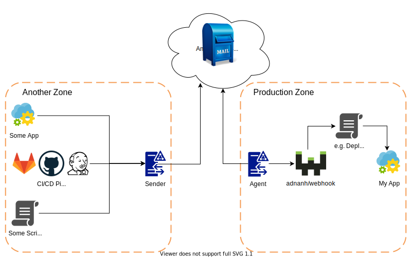

# Webhook SQS-Relay Sender

[adnanh/webhook](https://github.com/adnanh/webhook) is an awesome and simple solution to trigger deployments or cleanup scripts on servers, however when the webhook port is open on internet, it is always a challenge to secure it, not to mention when firewall configuration does not allow incoming connection from foreign servers. To mitigate this problem, SQS-Relay solution is developed. The work is based on [osbuild/webhook-relay](https://github.com/osbuild/webhook-relay), but rewritten in golang with dynamic queue names and direct support for [adnanh/webhook](https://github.com/adnanh/webhook). Please note that this solution has to be paired with a corresponding [agent](https://github.com/dpasdar/sqs-webhook-agent) installation.

# Architecture


1. Sender is a simple relay which works in two different mode, as a proxy web-server simulating the webhook, which enables sending the exact same payload and headers to this local server, which will then be forwarde to the webhook on target through SQS. Second mode is CLI, which will send exactly one message and quits. The second mode can be easily used in CI/CD docker environments (e.g. Gitlab CI/CD).

2. Agent will connect to the SQS from the target zone, receive the messages in the queue one after another in 5 second period, and forward them to the webhook.

# Installation
```
go get -u github.com/dpasdar/sqs-webhook-sender
```

In the style of golang's self-contained binaries, it will create one binary which can be copied/installed anywhere.

Optional, one can create a systemd unit file. A copy of the unit file can be found under the template/ directory. Follow the step below to create the service:

1. Copy the executable to /opt/sqs-webhook-sender/
2. Create an .env file in /opt/sqs-webhook-sender with the AWS credentials
3. Run the following to create the service (adjust the queue name in the template)
```
$ sudo useradd sqs-webhook-sender -s /sbin/nologin -M
$ sudo mkdir /opt/sqs-webhook-sender
$ sudo cp sqs/opt/sqs-webhook-sender
$ sudo cp sqs-webhook-sender.service /lib/systemd/system/.
$ sudo chmod 755 /lib/systemd/system/sqs-webhook-sender.service
$ sudo systemctl enable sqs-webhook-sender.service
```

# Running the Sender
Please make sure the following env variables are provided. Ideally, the access keys should only allow sqs operations:
```
AWS_ACCESS_KEY_ID
AWS_REGION
AWS_SECRET_ACCESS_KEY
```

Run the sender as follows:

```
$ sqs-webhook-sender
```

# Running as Docker

The public docker image hosted on GitHub can be used to send messages to different targets, provided that the Environment variables are set beforehand. An example can be found below.

# GitLab CI/CD example
1. Create `AWS_ACCESS_KEY_ID`, `AWS_REGION` and `AWS_SECRET_ACCESS_KEY` as CI/CD variables
2. Use the following configuration after the build stage to trigger e.g. a deployment:
```yaml
webhook-trigger:
  image:
    name: ghcr.io/dpasdar/sqs-webhook-sender/sender:0.1.1
    entrypoint:
      - /app/sender
      - -queue_name=some-name
      - -end_point=redeploy
  stage: webhook
  script:
    - echo nothing
  only:
    - master

```

The full example can be found [here](https://gitlab.com/dpasdar/deployment-test).
